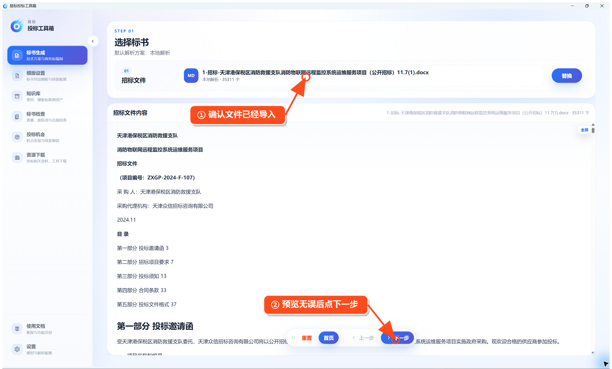
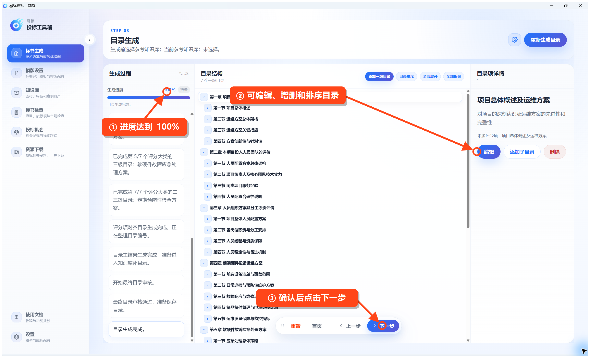

# 生成技术方案

在左侧点击 **标书生成 → 生成技术方案**。

## 第一步：选择招标文件

点击 **选择** 或 **替换**，导入招标文件。页面显示出解析后的正文后，点击底部 **下一步**。

**看这里：** 上方确认文件已经导入；中间可预览内容；右下角点击“下一步”。

## 第二步：解析招标文件

进入“招标文件解析”后，点击 **开始解析**。如果已经自动开始，只需等待。

项目概述、技术评分要求、项目信息、甲方信息、交货和服务要求全部显示“已完成”后，点击 **下一步**。

**看这里：** 左侧进度达到 5/5，列表全部为“已完成”，再进入下一步。

## 第三步：生成和检查目录

点击 **生成目录**，等待进度达到 100%。

生成完成后，重点检查目录是否符合投标要求：

- 点击目录项可查看说明。
- 可以编辑标题、添加子目录或删除多余目录。
- 需要调整顺序时，点击 **目录排序**。
- 确认无误后点击 **下一步**。

如果已经建立文档知识库，可在生成目录前点击右上角设置按钮，选择要参考的知识库。

## 第四步：检查全局事实

点击 **开始解析**，软件会整理项目名称、编号、工期、地点、人员等会在正文中反复使用的信息。

逐项检查内容。发现错误时直接编辑并保存；缺少内容时点击 **新增大项**。确认后点击 **下一步**。

## 第五步：生成正文并导出

需要调整字数或图片数量时，先点击右上角的设置按钮。然后点击 **生成正文**。

等待目录中的小节显示“已生成”后：

- 点击左侧小节查看正文。
- 点击右上角 **编辑** 修改当前小节。
- 点击底部 **导出 Word**，选择保存位置。

导出完成后，请打开 Word 检查目录、分页、图片和表格。
