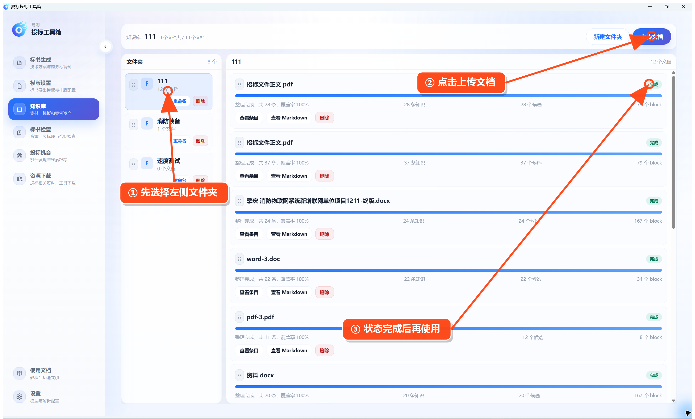

# 使用文档知识库

在左侧点击 **知识库 → 文档知识库**。

操作顺序：

1. 点击 **新建文件夹**，按项目或资料类型建立分类。
2. 选中左侧文件夹。
3. 点击 **上传文档**。
4. 等待文档状态变成“完成”。
5. 可点击 **查看条目** 或 **查看 Markdown** 检查解析结果。

知识库准备好后，可以在技术方案的“目录生成”设置中选择它，让生成内容参考已有资料。
