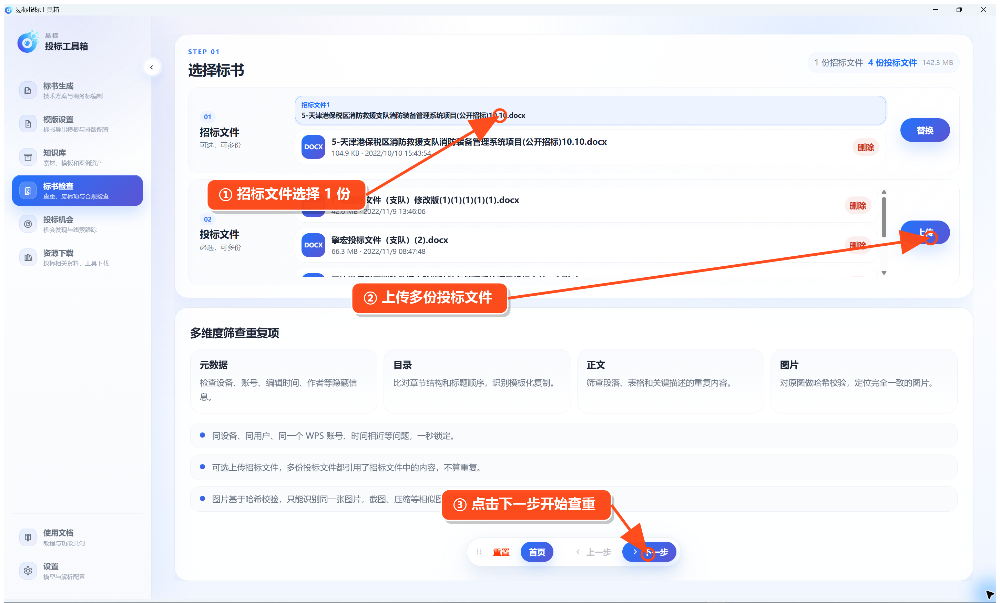
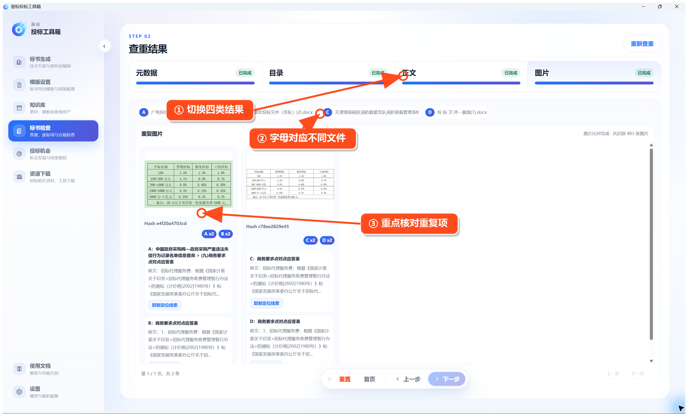

# 标书查重

在左侧点击 **标书检查 → 标书查重**。

第一步选择 1 份招标文件，再上传需要互相比较的多份投标文件，然后点击 **下一步**。

等待分析完成后，在结果页查看四类结果：

- **元数据**：设备、账号、编辑时间、作者等信息。
- **目录**：目录结构和标题顺序。
- **正文**：重复段落、表格和关键描述。
- **图片**：内容相同的图片。

点击顶部的文件字母，可查看重复内容来自哪些投标文件。发现问题后回到原文件修改，再重新查重。
