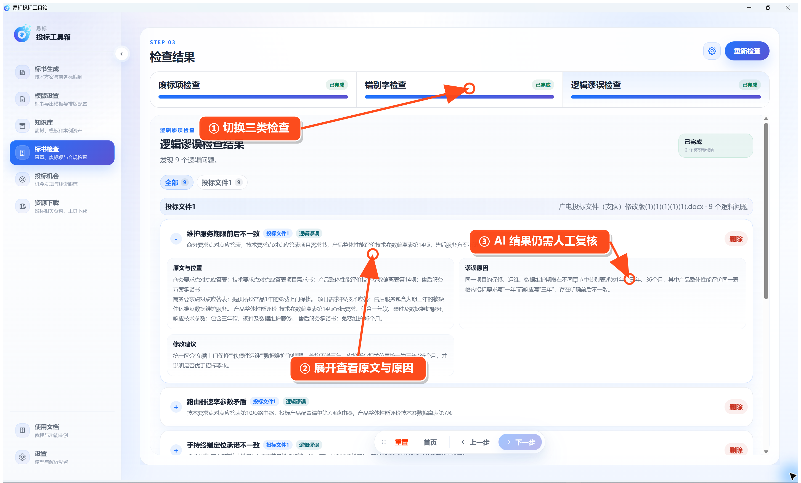

# 废标项检查

在左侧点击 **标书检查 → 废标项检查**。

操作顺序：

1. 选择招标文件和投标文件。
2. 点击 **下一步**，等待软件提取无效投标和废标条款。
3. 检查提取结果，必要时补充自定义检查项。
4. 再点击 **下一步 → 开始检查**。
5. 等待所有检查完成。

结果分为三类：

- **废标项检查**：检查硬性要求是否响应。
- **错别字检查**：检查明显文字错误。
- **逻辑谬误检查**：检查前后矛盾、时间不一致、参数冲突等问题。

点击每一条结果可查看原文位置和原因。AI 检查结果只作为辅助，提交标书前仍需人工确认。
