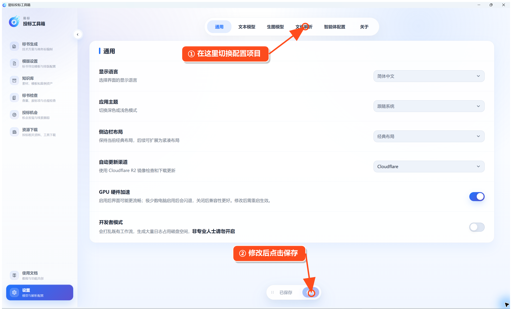

# 配置文本模型（必做）

第一次使用时，先点击左下角的 **设置**。进入设置后，可在顶部切换不同配置页。

进入 **设置 → 文本模型**，按下面顺序操作：

1. 选择服务提供商。
2. 填写 API Key。
3. 点击模型名称右侧的 **获取**，选择模型；也可以直接填写模型名称。
4. 点击 **测试**。
5. 测试成功后，点击底部 **保存**。

**看这里：** 主要检查“服务提供商、API Key、模型名称”三项。Base URL 一般会自动填写，只有使用自定义服务时才需要修改。

如果测试失败，先检查 API Key、模型名称和网络是否正常。
